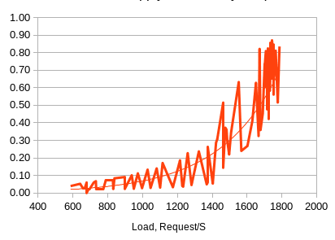
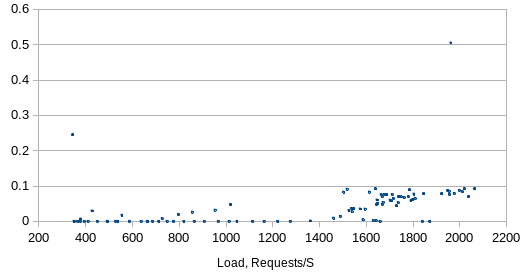

# Dave's _RED_ Rant

No, not _those_ guys!

## Intro
Red stands for _Requests, Errors and Duration_.

You use then as leading indicators of the health of your program:

* Requests, per second or per hour shows you how busy you are
    * if it falls to zero, something's definitely wrong
    * if it's going up, it can indicate goodness, like more transactions
* Errors per second are an obvious indication of problems
* Duration tells us how fast or slow the program is running
    * if a DSP suddenly takes too long, that's _A Bad Thing_

You often use them in pairs:
* if you plot duration per request, and it suddenly increases, 
you've detected a botttleneck. In this case you can see the 
sampled data (thick line) suddenly turns up at about
1,300 requests per second
    
* if errors spike at a particular request rate, 
it's a load-induced error. There are a few outliers, 
but you can see the error rate distinctly 
jumps up at 1,500 requests per second

## How to Use Them

The ExampleRed() function in red_test.go shows the simple case:
	
	func ExampleRed() {
	    // Initialize a red
	    var r = New()

	    // do some operations, let's say 3
	    for i := 0; i < 3; i++ {
	    	time.Sleep(1 * time.Second)
	    	// update r each time
	    	r.Add(r.Req, 1)
	    	if i == 1 {
	    		r.Add(r.Err, 1)
	    	}
	    	log.Printf("%s\n", r.Now().String())
	    }
	// Output:
    }

When run with `go test -v .` it returns    
    2021/12/18 13:00:01 1, 0, 1.000052s    
    2021/12/18 13:00:02 2, 1, 2.000498s    
    2021/12/18 13:00:03 3, 1, 3.000667s    

## In a Bigger Example
I'll add detail presently, that doesn't mention
anything from work (;-))
This is a weekend project, that I'm pitching to my colleagues.

In a fileserver, we added the red struct to the 
top-level class, "server", 

    // Server struct contains dependencies and sets up the model uploader service
    type Server struct {
        service *server
        ...
        logger  *zap.SugaredLogger
        red     r.Red
    }

and then initialize it in the server's `NewServer()` function

	return &Server{
		service: service,
		logger:  zap.S(),
		red:     r.New(), 
	}

When we start a unit of work, we increment `Requests`

		    s.red.Add(r.Req, 1) // Increment requests
		    err := s.doSomething(&req)
		    if err != nil {
		    	s.logger.Infof("bad request: unable to do something: %s", err)
		    	s.red.Add(r.Err, 1) // and then Errors
		    	return
		    }

When we are about to return an error, we increment `Errors`, as shown just above. 
Note that we're careful to do so only if the program is going 
to fail the request and then only once.  

We want the number of errors
to match the number of requests, so you can compare them.
Having 6 errors from 6 calls tells you _everything_ is failing, 
and you're in trouble, while one error from 6 means you just 
have a bug to fix.

When we report, we call `red.Now()` to compute the 
current duration, and then .String() to 
turn it into a report like `3, 1, 3.000667s`

            s.logger.Debug("/red")

    		if ok := s.service.IsHealthy(); ok {
	    		c.String(http.StatusOK, s.red.Now().String())
		    } else {
			    c.String(500, s.red.Now().String())
	    	}

Here we return it with the 250/500 http statuses REST 
callers want.

## Computing Rates

When we update the Red struct, you notice we didn't 
do any other computation. That's deliberate.  

Updating counters is cheap, and can be done lock-free. 
That keeps the cost of the updates down, at the expense
of making reporting expensive.  That's a classic trick
in the Solaris and Linux kernels to avoid the program
from being slowed down by having too many metrics.

This way we can have as many metrics as we want, and the
thread that reports them is the one that pay the price.
If you only call it once a minute or hour, you can report on
masses of things with a known and bounded cost.

If, for example, what we want to write to influx is the hourly rate of
uploads, then we call the metrics interface hourly and 
report the total number of uploads, errors and time elapsed,
Grafana can then report on the differences, which will be the 
hourly rates.

## Transactions Times
In the above example, we report on successful transactions.  
However, we didn't do anything interesting with duration.
By default, it turned into wall-clock time.
If all we wanted was the number of transactions since we started the program is what we want to 
measure, that would be fine, and we'd have been done.

If, however, our main metric is the speed of a transaction, 
we'll need to do something more.  First, we'll want to 
log each transaction (we do) and compute the number of records
we tried to send, the number of errors, and the time taken.

This changes the metrics to number of transactions, and the 
duration into the time taken to do the transaction rather 
than the wall-clock time,
but will require us to record the start time of each batch,
compute the time taken and report that instead of using 
the convenience function `red.Now()` to 
compute our elapsed time for us.

## Seconds or CPU-Seconds?

In some cases, we don't want wall-clock time, but rather CPU
time. If we need that, we can get it from the kernel in 
exactly the same fashion we have been using Red, by calling 

    err := syscall.Getrusage(syscall.RUSAGE_SELF, &r)
    if err != nil {
        ...
    }
    t := seconds(r.Utime) + seconds(r.Stime)

where seconds is

    // seconds converts a syscall.Timeval to seconds
    func seconds(t syscall.Timeval) float64 {
        return float64(time.Duration(t.Sec)*time.Second + time.Duration(t.Usec)*time.Microsecond) /float64(time.Second)
    }

and reporting the sum of user and system time.

## Conclusions

Red is a starting point: you may have many more metrics you 
want to report, you may want to receive them from many 
goroutines via the pipe, or you may need something I haven't 
even dreamed of.

If you need more, write an implementation that fits
the RED interface and go wild!